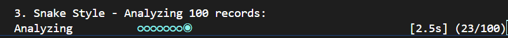

# Animotion

```
   ___          _                 __  _           
  / _ | ___    (_)_ _  ___  ___  / /_(_)__  ___   
 / __ |/ _ \  / /  ' \/ _ \/ _ \/ __/ / _ \/ _ \  
/_/ |_/_//_/ /_/_/_/_/\___/\___/\__/_/\___/_//_/  
                                                   
```
***Transform your boring progress bars into exciting terminal animations***

This tool is a creative alternative to [tqdm](https://github.com/tqdm/tqdm) with stunning terminal animations for process tracking.
---

## Features

- **15+ Unique Animation Styles**: From classic spinners to Matrix rain, bouncing balls, particles, DNA helixes, and more!
- **Highly Parametrized**: Customize colors, speed, width, messages, and display options
- **Easy to Use**: Simple API similar to tqdm, works as iterator wrapper or context manager
- **Cross-Platform**: Works on Windows, Linux, and macOS with colorama support
- **Lightweight**: Minimal dependencies, pure Python implementation
- **Thread-Safe**: Animations run in separate thread without blocking your code
- **Flexible**: Use with iterables, manual updates, or as a context manager

---

## Installation

> On development by now, not published on PyPi yet.

Install from source:

```bash
git clone https://github.com/edujbarrios/animotion.git
cd animotion
pip install -e .
```

---

### Example animation



Run `python demo_30s.py` for a full example list

---

## Quick Start

### Basic Usage

```python
import time
from animotion import animate

# Simple context manager
with animate(style="spinner", message="Processing"):
    time.sleep(3)

# Iterate over items
items = list(range(50))
for item in animate(items, style="wave", color="green"):
    time.sleep(0.1)  # Your processing here
```

### Advanced Usage

```python
from animotion import Animator, AnimationStyle

# Full control with Animator class
animator = Animator(
    style=AnimationStyle.MATRIX,
    width=60,
    message="Hacking the mainframe",
    color="green",
    speed=0.1,
    show_time=True,
    prefix=">>>",
    suffix="<<<"
)

animator.start()
# Your code here
time.sleep(5)
animator.stop("Complete!")
```

---

## Available Animation Styles

| Style | Description | Visual Style |
|-------|-------------|--------------|
| `spinner` | Classic rotating spinner | ⠋ ⠙ ⠹ ⠸ ⠼ ⠴ |
| `matrix` | Matrix-style falling characters | 01アイウ風 |
| `wave` | Smooth wave animation | ▁▂▃▄▅▆▇█ |
| `bouncing` | Bouncing ball | ● |
| `particles` | Random particles | ✦✧★☆ |
| `loading_dots` | Animated dots | ... |
| `progress_bar` | Progress bar | [████░░░] 60% |
| `blocks` | Animated blocks | ▖▘▝▗ |
| `arrows` | Rotating arrows | →↗↑↖←↙↓↘ |
| `pulse` | Pulsing effect | ░▒▓█ |
| `snake` | Snake movement | ◉○○○ |
| `fireworks` | Random fireworks | ✦✧★☆ |
| `dna` | DNA helix | ╱╲╱╲ |
| `clock` | Clock animation | 🕐🕑🕒 |
| `binary` | Binary rain | 01010110 |

---

## Documentation

### `animate()` Function

The main convenience function for quick animations.

```python
animate(
    iterable=None,      # Iterable to wrap (optional)
    style="spinner",    # Animation style
    width=40,           # Animation width
    message="",         # Display message
    color="cyan",       # Color: red, green, blue, yellow, magenta, cyan, white
    speed=0.1,          # Seconds per frame
    total=None,         # Total items for progress
    prefix="",          # Prefix text
    suffix="",          # Suffix text
    show_time=False     # Show elapsed time
)
```

### `Animator` Class

For more control over animations.

**Methods:**
- `start()` - Start the animation
- `stop(final_message=None)` - Stop the animation
- `update(n=1)` - Update progress by n
- `iterate(iterable)` - Wrap an iterable with animation

**Context Manager:**
```python
with Animator(style="wave", color="blue") as animator:
    # Your code here
    pass
```
---

## 🎨 Color Options

Available colors: `red`, `green`, `blue`, `yellow`, `magenta`, `cyan`, `white`

```python
# Red spinner
animate(style="spinner", color="red")

# Green matrix
animate(style="matrix", color="green")

# Blue wave
animate(style="wave", color="blue")
```

---

## Advanced Features

### Manual Control

### Progress with Time

```python
from animotion import animate

items = range(100)
for item in animate(items, style="progress_bar", show_time=True, color="green"):
    process(item)
```

### Custom Formatting

```python
from animotion import Animator

animator = Animator(
    style="pulse",
    prefix="[SYSTEM]",
    suffix="[OK]",
    message="Initializing",
    show_time=True,
    color="cyan"
)
```

---

## 📊 Comparison with tqdm

| Feature | Animotion | tqdm |
|---------|-----------|------|
| Progress bars | ✅ | ✅ |
| Creative animations | ✅ 15+ styles | ❌ |
| Context manager | ✅ | ✅ |
| Iterator wrapper | ✅ | ✅ |
| Color support | ✅ | Limited |
| Customization | ✅ Highly parametrized | ✅ |
| Fun factor | 🎨🎨🎨 | 📊 |

---


## Contributing

Contributions are welcome!

---

### Ideas for Contributions

- New animation styles
- Performance improvements
- Additional color schemes
- More examples
- Documentation improvements
- Bug fixes

---

## 👤 Author

**Eduardo J. Barrios**

- GitHub: [@edujbarrios](https://github.com/edujbarrios)
- Project: [animotion](https://github.com/edujbarrios/animotion)

---

## 🙏 Acknowledgments

- Inspired by [tqdm](https://github.com/tqdm/tqdm) for the progress bar concept

---

## API Reference

### List Available Styles

```python
from animotion import AnimationStyle

# Get all available styles
styles = AnimationStyle.list_styles()
print(styles)
```

### AnimationStyle Enum

```python
from animotion import AnimationStyle

# Use enum values
AnimationStyle.SPINNER
AnimationStyle.MATRIX
AnimationStyle.WAVE
AnimationStyle.BOUNCING
AnimationStyle.PARTICLES
AnimationStyle.LOADING_DOTS
AnimationStyle.PROGRESS_BAR
AnimationStyle.BLOCKS
AnimationStyle.ARROWS
AnimationStyle.PULSE
AnimationStyle.SNAKE
AnimationStyle.FIREWORKS
AnimationStyle.DNA
AnimationStyle.CLOCK
AnimationStyle.BINARY
```

## Performance

Animotion runs animations in a separate thread, ensuring minimal impact on your main code performance. The animation overhead is typically less than 1% of CPU usage.

---

## Troubleshooting

### Colors not showing on Windows?

Animotion uses `colorama` which should work automatically. If colors don't show:

```bash
pip install --upgrade colorama
```

### Animation appears jumpy?

Adjust the `speed` parameter:

```python
# Slower, smoother
animate(style="wave", speed=0.05)

# Faster
animate(style="spinner", speed=0.15)
```
---
